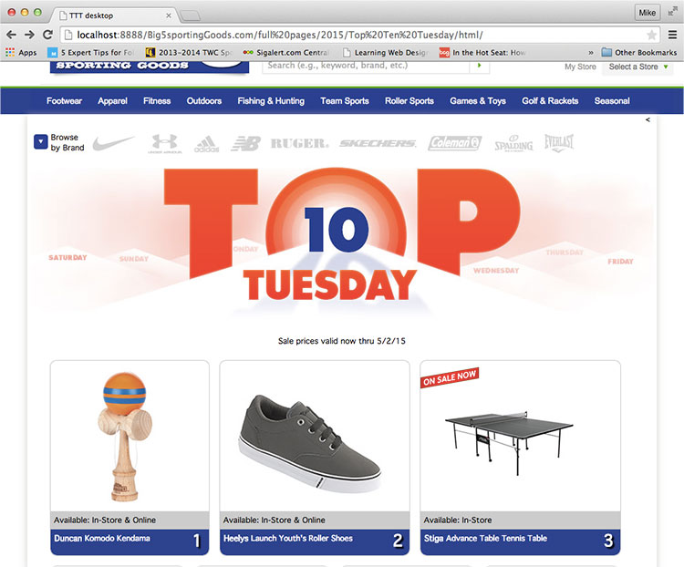
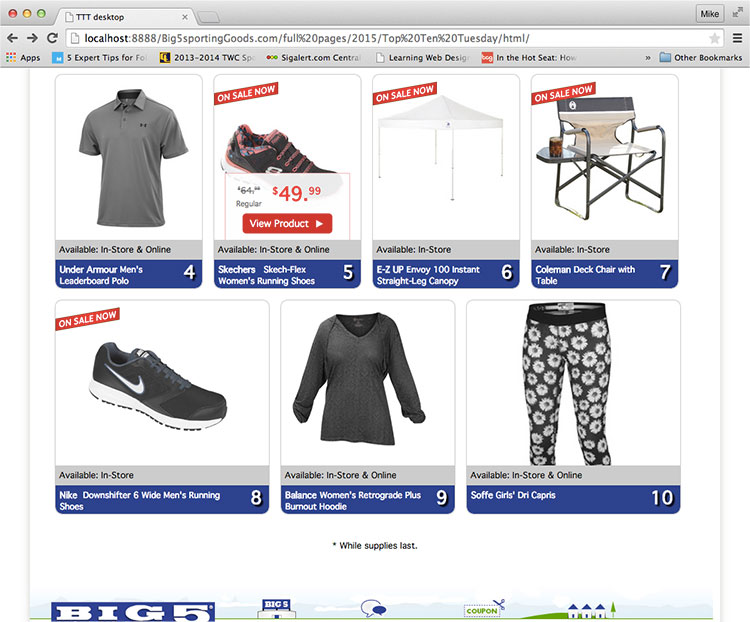
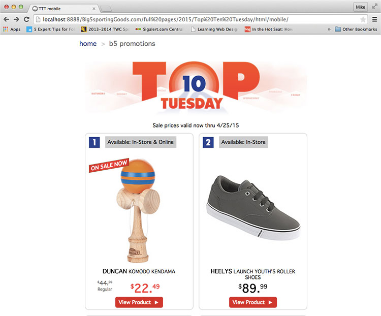
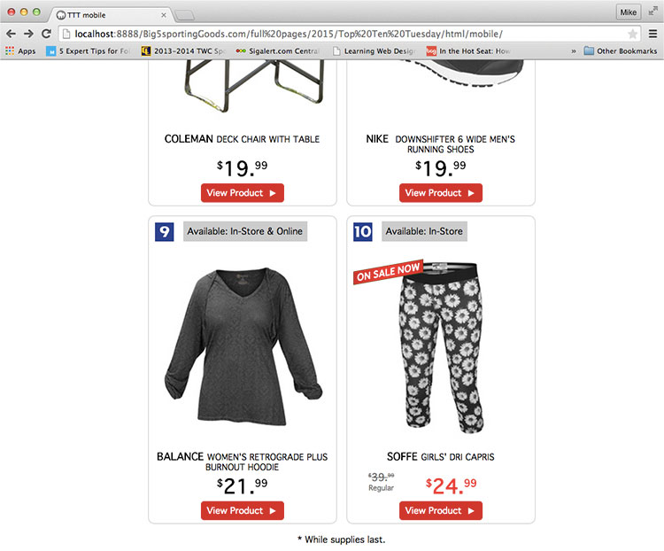
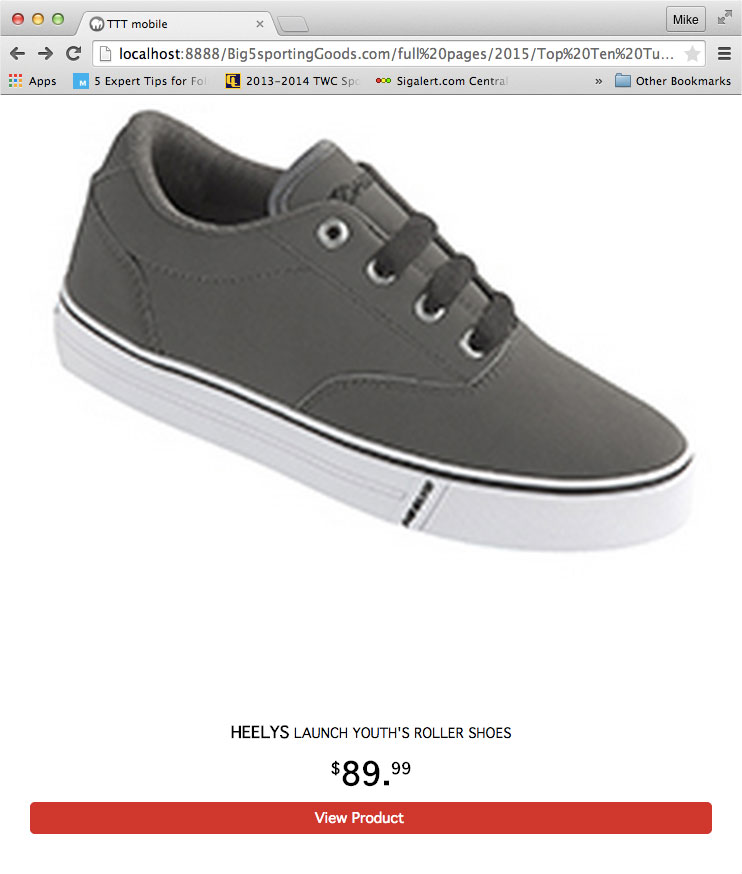

  
`big5sportinggoods.com`  

# Dates:  
2015  
# Technologies:  
HTML5, CSS3, Desktop and Mobile versions   
# Description:  
This website is a promotion that ran every Tuesday for a week.  New items were featured every week.  

**Desktop version**  
In the root folder in **index.html**,  
the CSS styles I created are between the comments  
`<!-- Michael de Leon's CSS styles.  CUT HERE. CUSTOM CSS BEGIN -->`  
and  
`<!-- Michael de Leon's CSS styles.  CUT HERE. CUSTOM CSS END -->`  

My HTML code is between the comments  
`<!-- Michael de Leon's code.  CUT HERE. CUSTOM CODE BEGIN -->`  
and  
`<!-- Michael de Leon's code.  CUT HERE. CUSTOM CODE END -->`

**Mobile version**  
In the mobile folder in **index.html**,  
the CSS styles I created are between the comments  
`<!-- Michael de Leon's CSS styles.  CUT HERE. CUSTOM CSS BEGIN -->`  
and  
`<!-- Michael de Leon's CSS styles.  CUT HERE. CUSTOM CSS END -->`  

My HTML code is between the comments  
`<!-- Michael de Leon's code.  CUT HERE. CUSTOM CODE BEGIN -->`  
and  
`<!-- Michael de Leon's code.  CUT HERE. CUSTOM CODE END -->`  
# Screenshots:
  

  

  

  

  
